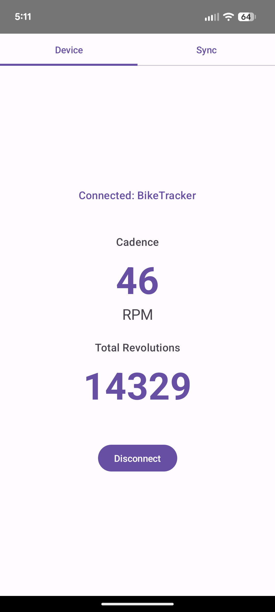

# BLE Bike Tracker

A custom ESP32-based tracking system that transforms a "dumb" stationary bike
into a smart fitness device that syncs with Google Health Connect--without
vendor lock-in or proprietary apps.

## Blog Posts

[I Put an ESP32 in My Stationary Bike](https://www.kylehusmann.com/posts/2025/esp32-stationary-bike/) -
Read about the motivation, hardware installation, and initial setup.

[AI-Coding a Mobile App and Firmware for My Stationary Bike](https://www.kylehusmann.com/posts/2025/ai-coding-mobile-app-firmware-stationary-bike) -
Read about my experience coding the firmware and mobile app with Claude Code.

## Overview

This project consists of ESP32 firmware (MicroPython) and an Android companion
app (Kotlin) that work together to:

1. **Track pedaling activity** using the bike's existing reed switch sensor
2. **Display real-time cadence** in the mobile app via Bluetooth Low Energy
   (BLE)
3. **Automatically sync workout sessions** to Google Health Connect in the
   background

## Mobile App Features

### Device Tab

<div align="center"> 
   <table>
   <tr>
      <td align="center"><b>Disconnected</b></td>
      <td align="center"><b>Connected</b></td>
   </tr>
   <tr>
      <td></td>
      <td></td>
   </tr>
   </table>
</div>

- Live cadence display (RPM)
- Total revolution count (since power on)
- Connection status indicator
- Manual connect/disconnect controls

### Background Sync Settings Tab

<div align="center"> 
   <table>
   <tr>
      <td></td>
   </tr>
   </table>
</div>

- Last sync timestamp (relative and absolute)
- Last synced session timestamp
- Sync success/failure counts
- Enable/disable periodic background sync
- Manual "Sync Now" button
- Battery optimization warning
- Timestamp divergence detection (to debug issues saving data to Health Connect)

## Firmware Features

### Session Management

- **Automatic detection:** Sessions start on first pedal rotation
- **Idle timeout:** 5 minutes of inactivity ends the session
- **Minimum duration:** Sessions shorter than 5 minutes are discarded
- **Periodic saving:** Sessions saved every 5 minutes to prevent data loss
- **Storage format:** Individual JSON files per session
  (`/sessions/{timestamp}.json`)

### Development Features

- **WiFi connectivity** for over-the-air updates
- **WebREPL** for wireless file transfer and debugging
- **Type hints** throughout (using `3rdparty/typing.py` shim)
- **Configuration profiles** for dev/prod environments

### BLE Services

The firmware exposes two complementary BLE services:

1. **CSC Service** (Cycling Speed & Cadence - standard BLE profile)

   - Service UUID: `0x1816`
   - Broadcasts cadence data every 2 seconds while connected
   - Used for real-time display in the Android app

2. **Sync Service** (custom protocol)
   - Service UUID: `0000FF00-0000-1000-8000-00805f9b34fb`
   - Timestamp-based sync loop for retrieving historical sessions
   - Multi-client safe with no server-side state
   - Transfers sessions as JSON over BLE

### Sync Protocol Details

The custom sync service uses a stateless, timestamp-based protocol:

1. Client writes last synced timestamp (uint32, little-endian)
2. Server responds with next session JSON + remaining session count
3. Client repeats until count reaches zero

## Hardware Setup

**Platform:** ESP32-S3 DevKit with wall power (USB-C)

**Components:**

- **Microcontroller:** ESP32-S3 mounted in 3D-printed enclosure
- **Power:** USB-C panel connector installed at bike base
- **Sensor:** Spliced into existing reed switch (GPIO 5) to monitor crank
  rotations
  - Maintains compatibility with original LCD display
- **Status LED:** GPIO 4, drilled into bike chassis

The reed switch closes once per pedal revolution, allowing the ESP32 to track
cadence without adding new sensors.

## Project Structure

```
ble-bike-tracker/
├── firmware/             # ESP32 MicroPython firmware
├── android/              # Android companion app
├── dev/                  # Development notes
└── prints/               # YAPP Box Enclosure Design
```

## Building and Running

See component-specific READMEs for detailed setup instructions:

- [Firmware Setup](firmware/README.md) - MicroPython installation and WiFi
  configuration
- [Android Build](android/README.md) - Gradle commands and dependencies

Quick start:

```bash
# Firmware (after initial USB setup -- see firmware/README.md)
cd firmware
source activate.sh
make push        # Deploy code via WebREPL
make repl        # Connect to REPL

# Android
cd android
./gradlew assembleDebug
./gradlew installDebug
```
